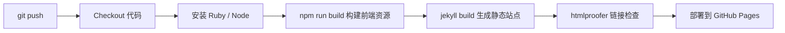

本文记录如何从零搭建一个个人博客，并用 **Markdown** 写文章、通过 **GitHub Actions** 自动部署到 **GitHub Pages**。整套方案免费、稳定，适合长期维护技术笔记与生活记录。

## 你将得到什么

- 一个可通过 `https://<你的用户名>.github.io` 访问的个人网站
- 用 Markdown 写博客，专注内容而非前端
- 每次 `git push` 后自动构建、自动发布
- 基于 [Jekyll](https://jekyllrb.com/) 静态站点生成器 + [Chirpy](https://github.com/cotes2020/jekyll-theme-chirpy) 主题

## 技术栈一览

| 组件 | 作用 |
|------|------|
| **Jekyll** | 把 Markdown 和配置文件转成静态 HTML |
| **Chirpy 主题** | 提供博客布局、暗色模式、搜索、目录等能力 |
| **Markdown** | 文章正文的书写格式 |
| **GitHub Actions** | 在云端自动执行 `jekyll build` 并部署 |
| **GitHub Pages** | 托管生成的静态网站 |

> **为什么不直接用 GitHub 内置 Jekyll？**
>
> Chirpy 依赖自定义插件和前端资源构建，GitHub 内置 Jekyll 无法完整支持。因此需要通过 **GitHub Actions** 在 CI 环境中构建后再部署。

---

## 第一步：创建 GitHub 仓库

### 1. 注册 / 登录 GitHub

前往 [github.com](https://github.com) 完成注册。

### 2. 用官方模板创建博客仓库（推荐）

最省事的方式是使用 Chirpy 官方提供的 Starter 模板：

1. 打开 [chirpy-starter](https://github.com/cotes2020/chirpy-starter)
2. 点击 **Use this template** → **Create a new repository**
3. 仓库名必须为：

```text
<你的GitHub用户名>.github.io
```

例如用户名为 `zhang-hong-yang`，则仓库名为 `zhang-hong-yang.github.io`。

4. 选择 **Public**，点击 **Create repository**

> GitHub Pages 个人站点要求仓库名与用户名严格对应，否则无法通过 `username.github.io` 访问。

### 3. 克隆到本地

```bash
git clone git@github.com:<你的用户名>/<你的用户名>.github.io.git
cd <你的用户名>.github.io
```

---

## 第二步：配置站点信息

编辑仓库根目录的 `_config.yml`，至少修改以下几项：

```yaml
lang: zh-CN
timezone: Asia/Shanghai

title: 你的博客名
tagline: 一句话简介
description: >-
  博客描述，会出现在 SEO 和 RSS 中。

url: "https://<你的用户名>.github.io"

github:
  username: <你的用户名>

social:
  name: 你的昵称
  email: your@email.com   # 可选
  links:
    - https://github.com/<你的用户名>
```

保存后，站点语言、时区、社交链接等就会生效。

---

## 第三步：启用 GitHub Actions 部署

Chirpy Starter 自带部署配置，但默认放在 `starter` 子目录下，需要移到正确位置才能被 GitHub 识别。

### 1. 移动 Workflow 文件

如果仓库中存在 `.github/workflows/starter/pages-deploy.yml`，执行：

```bash
cp .github/workflows/starter/pages-deploy.yml .github/workflows/pages-deploy.yml
```

若使用完整版 Chirpy 主题仓库，同样需要确保根目录存在 `.github/workflows/pages-deploy.yml`。

### 2. Workflow 做了什么

部署流程大致如下：



核心配置示例（已精简）：

```yaml
name: "Build and Deploy"
on:
  push:
    branches: [main, master]
  workflow_dispatch:

jobs:
  build:
    runs-on: ubuntu-latest
    steps:
      - uses: actions/checkout@v4
        with:
          fetch-depth: 0
          submodules: true

      - uses: actions/configure-pages@v4
        id: pages

      - uses: ruby/setup-ruby@v1
        with:
          ruby-version: 3.3
          bundler-cache: true

      - uses: actions/setup-node@v4
        with:
          node-version: lts/*

      - run: npm install && npm run build
      - run: bundle exec jekyll b -d "_site${{ steps.pages.outputs.base_path }}"
        env:
          JEKYLL_ENV: production

      - uses: actions/upload-pages-artifact@v3
        with:
          path: "_site${{ steps.pages.outputs.base_path }}"

  deploy:
    needs: build
    runs-on: ubuntu-latest
    environment:
      name: github-pages
    steps:
      - uses: actions/deploy-pages@v4
```

### 3. 初始化子模块（如需要）

若项目包含 `assets/lib` 子模块，在本地执行一次：

```bash
git submodule update --init --recursive
```

GitHub Actions 中 `submodules: true` 会在云端自动拉取。

---

## 第四步：在 GitHub 开启 Pages

这是最容易遗漏的一步。

1. 打开仓库 → **Settings** → **Pages**
2. 在 **Build and deployment** 区域：
   - **Source** 选择 **GitHub Actions**
   - 不要选 “Deploy from a branch”
3. 保存设置

然后提交并推送代码：

```bash
git add .
git commit -m "feat: setup blog and enable GitHub Actions deployment"
git push origin master   # 或 main，取决于你的默认分支
```

推送后，进入仓库 **Actions** 标签页，查看 `Build and Deploy` 是否成功。首次部署通常需要 2～5 分钟。

成功后访问：

```text
https://<你的用户名>.github.io
```

### 5. 查看 GitHub Actions 构建进度

推送代码后，可以在 GitHub 网页上实时查看部署进度。

#### 进入 Actions 页面

打开你的仓库，点击顶部导航栏的 **Actions** 标签。

#### 查看运行列表

左侧选择 **Build and Deploy** workflow，右侧是按时间排列的运行记录：

| 状态图标 | 含义 |
|----------|------|
| 黄色圆点 | 正在运行 |
| 绿色勾 | 构建成功 |
| 红色叉 | 构建失败 |

#### 查看详细步骤

点击某一次运行记录，可以看到两个 job：

1. **build** — 拉取代码、安装依赖、构建站点
2. **deploy** — 部署到 GitHub Pages

点进 **build** job，左侧会列出每个 step 的执行情况，例如：

- Checkout
- Setup Pages
- Setup Ruby
- Build assets
- Build site
- Test site
- Upload site artifact

正在执行的 step 显示黄色进度，已完成的显示绿色勾。点击某个 step 可展开查看完整日志，排查报错时非常有用。

#### 其他查看方式

- **仓库首页**：最近 push 的 commit 旁边可能显示黄色或绿色状态图标，点击可跳转到对应运行记录
- **Settings → Pages**：部署成功后，会显示站点地址和最近一次部署状态
- **邮件通知**：若开启了 GitHub 通知，构建失败时可能收到邮件提醒

#### Actions 页面为空？

如果 **Actions** 标签页没有任何记录，常见原因：

1. 还没有 push 过代码
2. Pages 来源尚未改为 **GitHub Actions**
3. workflow 文件不在 `.github/workflows/` 根目录下

一般 push 后等待 **2～5 分钟**，看到 **build** 和 **deploy** 两个 job 都变绿，即表示部署完成，可以访问你的博客了。

---

## 第五步：用 Markdown 写文章

### 1. 文件位置与命名

所有文章放在 `_posts/` 目录，文件名格式固定为：

```text
YYYY-MM-DD-文章slug.md
```

示例：

```text
_posts/2026-06-18-my-first-post.md
```

### 2. 文章结构

每篇文章以 YAML front matter 开头，后跟 Markdown 正文：

```markdown
---
title: 我的第一篇文章
description: 这是摘要，显示在首页列表中
date: 2026-06-18 12:00:00 +0800
categories: [技术]
tags: [Jekyll, 博客]
pin: false          # true 可置顶
---

## 标题

正文支持 **粗体**、*斜体*、列表、表格等标准 Markdown 语法。

### 代码块

```python
def hello():
    print("Hello, Blog!")
```

### 图片

```markdown

```

图片可放在仓库内，也可使用图床 URL。
```

### 3. 发布文章

```bash
git add _posts/2026-06-18-my-first-post.md
git commit -m "docs: add my first post"
git push
```

推送后 GitHub Actions 会自动重新构建，无需手动操作服务器。

---

## 第六步：自定义页面（可选）

Chirpy 在 `_tabs/` 目录提供固定页面，例如：

| 文件 | 页面 |
|------|------|
| `_tabs/about.md` | 关于 |
| `_tabs/archives.md` | 归档 |
| `_tabs/categories.md` | 分类 |
| `_tabs/tags.md` | 标签 |

直接编辑对应 Markdown 文件即可，无需额外路由配置。

---

## 常见问题排查

### 首页显示 `--- layout: home ---` 原文

**原因**：Jekyll 没有执行构建，浏览器直接渲染了 `index.html` 源文件。

**解决**：

1. 确认 Pages 来源为 **GitHub Actions**（不是 branch 直出）
2. 确认 `.github/workflows/pages-deploy.yml` 存在且已推送
3. 查看 Actions 日志是否有构建失败

### Actions 构建失败：找不到前端资源

**原因**：Chirpy 需要先执行 `npm run build` 生成 `assets/js/dist/`。

**解决**：确保 workflow 中包含 Node 安装和 `npm install && npm run build` 步骤。

### 子模块相关错误

**原因**：`assets/lib` 未初始化。

**解决**：

```bash
git submodule update --init --recursive
git add assets/lib
git commit -m "chore: init assets submodule"
git push
```

### 修改 `_config.yml` 后页面没变化

Jekyll 对 `_config.yml` 的修改需要**重新完整构建**。推送后等待 Actions 跑完即可，本地预览也需重启 `jekyll serve`。

---

## 本地预览（可选）

想在推送前本地查看效果，可安装依赖后启动：

```bash
# 初始化子模块
git submodule update --init --recursive

# 安装依赖
bundle install
npm install && npm run build

# 启动本地服务
bundle exec jekyll serve
```

浏览器访问 `http://127.0.0.1:4000`。

---

## 日常维护流程

```text
写文章 → 保存到 _posts/ → git commit → git push → Actions 自动部署 → 网站更新
```

建议保持这个简单循环，把精力放在写作上。

---

## 参考链接

- [Jekyll 官方文档](https://jekyllrb.com/docs/)
- [Chirpy 主题 Wiki](https://github.com/cotes2020/jekyll-theme-chirpy/wiki)
- [Chirpy Starter 模板](https://github.com/cotes2020/chirpy-starter)
- [GitHub Pages 文档](https://docs.github.com/en/pages)
- [GitHub Actions 文档](https://docs.github.com/en/actions)

---

以上就是从 0 到部署 GitHub Pages 的完整流程。如果你按步骤操作后仍遇到问题，优先检查 **Actions 构建日志** 和 **Pages 来源设置**，大多数问题都出在这两处。
