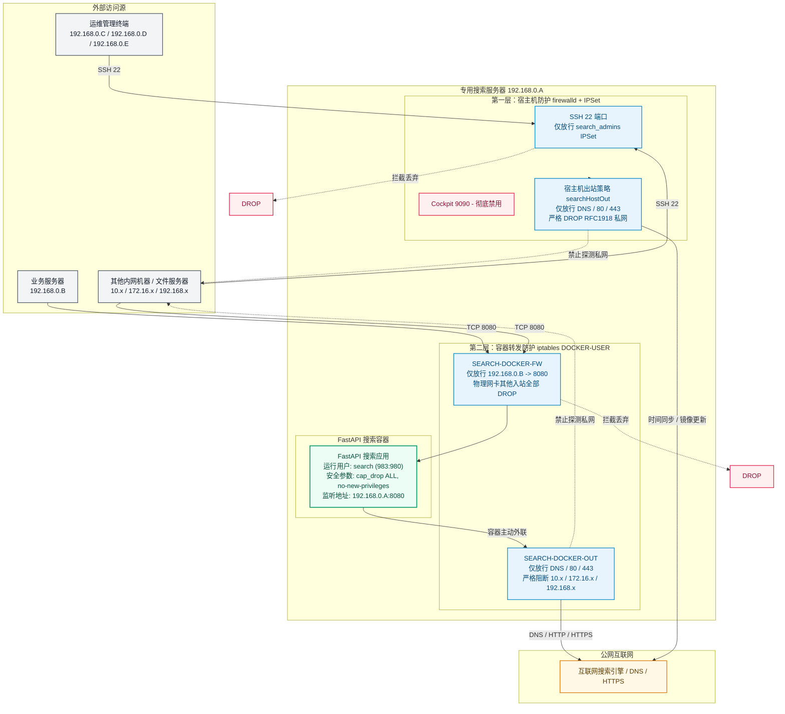
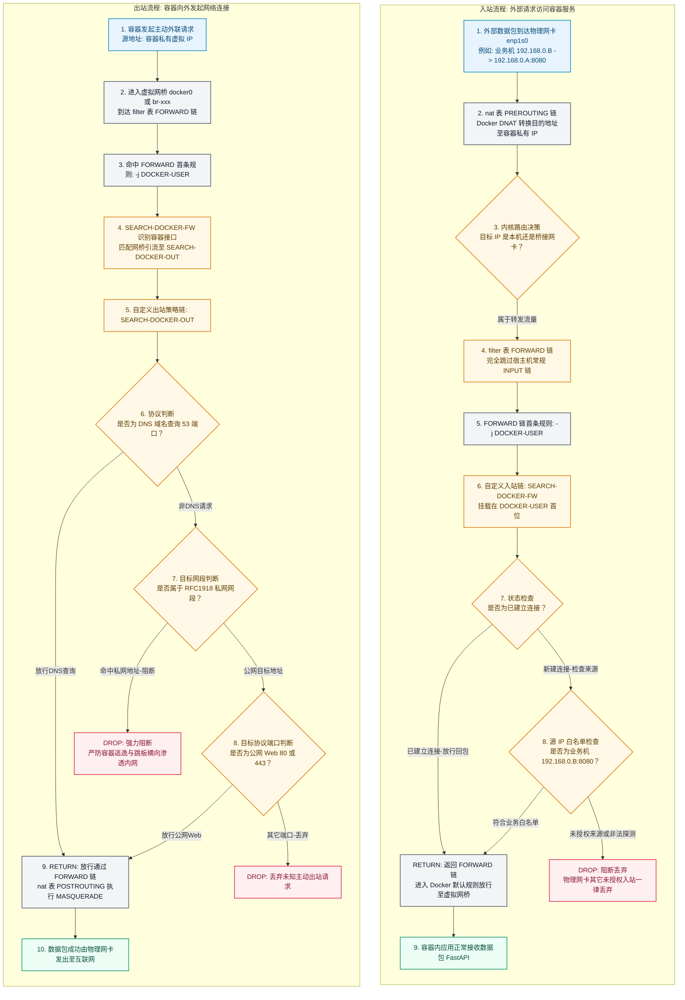

在企业内网微服务、私有化部署及业务中台架构中，业务服务器往往保存着大量的核心业务数据与内部资产，通常运行在严格禁止访问公网的内网环境中。然而，为了让内部业务能够获取实时的外部信息，系统不可避免地需要**联网搜索**能力。

如果直接放开业务服务器的外网访问权限，将带来极大的数据泄露风险；而若将专门用于外网搜索的代理/服务部署在内网中，该服务一旦遭遇 **SSRF（服务端请求伪造）、提示词注入攻击、第三方 Web 漏洞或命令执行攻击**，就极易沦为攻击者横向渗透内网的“跳板机”，进而威胁同网段的业务机、数据库和文件存储。

本文基于真实生产环境部署实践，详细介绍一套**内网搜索服务隔离部署与双层纵深防御体系**：通过将宿主机防护（firewalld + IPSet）与 Docker 转发防护（iptables `DOCKER-USER` 链）分层结合，实现**业务 API 严格单向调用、宿主机与容器全方位禁止主动探测内网（RFC1918）、非 root 最小特权运行以及 Docker 重启自动恢复闭环**。所有工程脚本均完整嵌入在文末与各章节中，可直接在生产环境复用落地。

---

## 1. 架构设计与核心安全威胁模型

### 1.1 业务场景与网络拓扑

系统架构由核心业务服务器、安全审计层以及位于隔离区（DMZ）的自研搜索服务组成。搜索服务部署在专用服务器（示例 IP：`192.168.0.A`），通过 FastAPI 提供内部 HTTP 接口供业务服务器（示例 IP：`192.168.0.B`）调用。



### 1.2 核心安全原则

1. **单向调用契约**：允许业务服务器（`192.168.0.B`）主动调用搜索服务器（`192.168.0.A`）的 `8080` 端口；响应流量由 Linux 连接跟踪（`conntrack`）状态放行，**严格禁止搜索服务器主动反向发起连接至业务内网**。
2. **禁止横向移动（Lateral Movement）**：搜索宿主机与容器内部，除了向指定的 DNS 服务器发起域名解析、以及向公网发起 HTTP/HTTPS 请求外，**绝对禁止向 RFC1918 私网地址（`10.0.0.0/8`、`172.16.0.0/12`、`192.168.0.0/16`）发起任何连接**。
3. **突破 Docker 默认旁路机制**：Docker 默认会在 iptables 的 `PREROUTING` 与 `FORWARD` 链注入 DNAT 和放行规则，绕过宿主机的 `INPUT` 链防火墙。必须在 Docker 官方预留的 `DOCKER-USER` 链上构建严格的入站与出站过滤机制。
4. **运行时最小特权**：容器内严禁使用 root 身份运行，宿主机创建无登录权限的低特权专用账户 `search`（UID 983 / GID 980），容器启动配置 `cap_drop: ALL` 与 `no-new-privileges: true`。
5. **故障与重启自愈**：当 Docker daemon 重启或系统网络重载导致 iptables 链重置时，通过 systemd 依赖关系自动重新装载防火墙策略。

---

## 2. 宿主机与容器隔离策略矩阵

| 序号 | 流量方向 | 业务类型         | 源地址 / 集合                     | 目的地址 / 网段          | 协议与端口         | 动作          | 承载与实现组件                        |
| :--- | :------- | :--------------- | :-------------------------------- | :----------------------- | :----------------- | :------------ | :------------------------------------ |
| 1    | **入站** | SSH 运维管理     | IPSet: `search_admins` (.C/.D/.E) | 搜索宿主机 (192.168.0.A) | TCP 22             | **ACCEPT**    | firewalld (`public` zone 富规则)      |
| 2    | **入站** | 非法 SSH 连接    | 其他任意 IP                       | 搜索宿主机               | TCP 22             | **DROP**      | firewalld (`public` zone target=DROP) |
| 3    | **入站** | Web 控制台       | 任意 IP                           | 搜索宿主机               | TCP 9090 (Cockpit) | **关闭/DROP** | 禁用 systemd socket + firewalld 移除  |
| 4    | **入站** | 搜索 API 调用    | 白名单业务机 (192.168.0.B)        | 搜索宿主机 (192.168.0.A) | TCP 8080           | **RETURN**    | iptables (`SEARCH-DOCKER-FW` 链)      |
| 5    | **入站** | 其它容器流量     | 物理网卡 `enp1s0` 任意非白名单    | 容器网络                 | 任意端口           | **DROP**      | iptables (`SEARCH-DOCKER-FW` 链)      |
| 6    | **出站** | 域名解析 (DNS)   | 宿主机 / 容器                     | 指定或任意 DNS           | UDP/TCP 53         | **ACCEPT**    | 优先级 `-300` 优先放行                |
| 7    | **出站** | **私网探测拦截** | **宿主机 / 容器**                 | **RFC1918 私网网段**     | **任意端口**       | **DROP**      | **优先级 `-200` 强力阻断私网**        |
| 8    | **出站** | 公网搜索查询     | 宿主机 / 容器                     | 公网互联网               | TCP 80, 443        | **ACCEPT**    | 优先级 `-100` 放行公网 Web            |
| 9    | **出站** | 未定义其它出站   | 宿主机 / 容器                     | 任意地址                 | 其它端口           | **DROP**      | 默认策略丢弃                          |

---

## 3. 基础环境与专用账户安全加固

### 3.1 专用运行账户规划

在宿主机上创建专用于运行搜索容器进程的系统用户 `search`。该用户仅作为容器内部映射的 UID/GID 使用，**不具备宿主机交互登录权限，严禁赋予 sudo 权限，且严禁加入 docker 用户组**（加入 docker 组等同于获得 root 权限）。

```bash
# 创建系统非特权账户
useradd -r -s /sbin/nologin search

# 查看生成的 UID 与 GID（通常为 983:980 或 1000:1000）
id search
# 输出示例: uid=983(search) gid=980(search) groups=980(search)
```

### 3.2 规范化目录结构与权限模型

整个搜索服务的运行时文件收敛至 `/data/search`，按角色划分所有权与权限模式：

```text
/data/search
├── docker-compose.yml       # 编排文件 (root:root, 640)
├── .env                     # API 密钥等敏感配置 (root:root, 600)
├── config/                  # 应用静态配置文件 (root:search, 750)
├── data/                    # 运行时数据 (search:search, 750)
├── logs/                    # 运行时日志 (search:search, 750)
├── scripts/                 # 运维与防火墙脚本 (root:root, 750)
└── images/                  # 离线镜像存储 (root:root, 750)
```

#### 初始化脚本：`search-init.sh`

直接将以下脚本保存并在宿主机以 root 执行，快速完成目录骨架与权限初始化：

```bash
#!/usr/bin/env bash
set -euo pipefail

# =============================================================
# 搜索服务 Docker 部署目录与权限初始化脚本
# =============================================================

echo "[1/4] 检查系统 search 用户..."
if ! id search >/dev/null 2>&1; then
    useradd -r -s /sbin/nologin search
    echo "系统用户 search 创建成功。"
else
    echo "系统用户 search 已存在: $(id search)"
fi

echo "[2/4] 创建目录结构..."
mkdir -p /data/search/{config,data,logs,scripts,images}
touch /data/search/docker-compose.yml
touch /data/search/.env

echo "[3/4] 配置严格的权限与所有权..."
# 主目录与编排配置归属 root
chown root:root /data/search
chmod 750 /data/search

chown root:root /data/search/docker-compose.yml
chmod 640 /data/search/docker-compose.yml

# .env 存放敏感 API Key，仅 root 600 可读写
chown root:root /data/search/.env
chmod 600 /data/search/.env

# config: root 管理，search 用户所在组有读执行权限
chown -R root:search /data/search/config
chmod 750 /data/search/config

# data 与 logs: search 用户读写
chown -R search:search /data/search/data /data/search/logs
chmod 750 /data/search/data /data/search/logs

# 脚本与离线镜像归属 root
chown -R root:root /data/search/scripts /data/search/images
chmod 750 /data/search/scripts /data/search/images

echo "[4/4] 验证权限布局："
ls -la /data/search
echo "目录初始化完成！"
```

---

## 4. 容器安全编排与离线管控

### 4.1 离线镜像导入与安全审查

在生产受限网络下，建议在构建机通过 `docker save` 打包带版本号的镜像，拷贝至 `/data/search/images/` 导入：

```bash
cd /data/search/images
docker load -i search-service-1.0.1.tar

# 检查镜像内置元数据（User、默认端口与启动命令）
docker inspect search-service:1.0.1 --format 'User={{.Config.User}} Exposed={{json .Config.ExposedPorts}} Cmd={{json .Config.Cmd}}'
```

> [!TIP]
> 很多官方镜像默认使用 root 运行且暴露 80 端口。非 root 用户（UID 983）无权绑定 1024 以下特权端口，因此必须在 Compose 中显式指定运行用户为 `983:980`，并将应用服务端口指定为非特权端口（如 `8080`）。

### 4.2 生产级 Docker Compose 配置

创建 `/data/search/docker-compose.yml`：

```yaml
services:
  search-service:
    image: search-service:1.0.1
    container_name: search-service
    restart: unless-stopped

    # 1. 强制使用非 root 专用 UID:GID 运行容器进程
    user: "983:980"

    # 2. 指定 FastAPI 启动在非特权端口 8080
    command:
      - fastapi
      - run
      - app/main.py
      - --port
      - "8080"

    # 3. 明确绑定宿主机特定物理 IP，避免绑定至 0.0.0.0
    ports:
      - "192.168.0.A:8080:8080"

    # 4. 敏感环境变量注入（从 .env 文件安全读取）
    env_file:
      - .env
    environment:
      TZ: Asia/Shanghai

    # 5. Linux 内核级权限收敛
    security_opt:
      - no-new-privileges:true  # 禁用 setuid 提权
    cap_drop:
      - ALL                    # 剥夺所有 Linux Capabilities

    # 6. 挂载持久化目录（读写权限严格控制）
    volumes:
      - ./config:/app/config:ro
      - ./data:/app/data:rw
      - ./logs:/app/logs:rw

    # 7. 日志文件大小轮转，防止磁盘写满
    logging:
      driver: json-file
      options:
        max-size: "100m"
        max-file: "5"
```

启动并验证容器内进程身份：

```bash
cd /data/search
docker compose up -d

# 检查容器内部运行用户
docker exec search-service id
# 正确输出: uid=983 gid=980 groups=980
```

---

## 5. Docker 转发层防火墙与出网隔离实战

### 5.1 官方首推标准：为什么必须使用 `DOCKER-USER`？

Docker 在 Linux 下通过 iptables 来实现容器网络桥接与端口发布。当容器映射外部端口（例如 `-p 192.168.0.A:8080:8080`）时，Docker 守护进程会自动进行两步网络配置：
1. 在 `nat` 表的 `PREROUTING` 链写入规则，将外部请求的目标 IP 和端口通过 DNAT 转换为容器的私有 IP 与应用端口。
2. 在 `filter` 表的 `FORWARD` 链将流量引向 Docker 内部的 `DOCKER` 链，并默认放行。

**这就导致了一个极其严重的安全现象：常规配置在宿主机 `INPUT` 链上的防火墙规则（无论是 firewalld 的 public zone、富规则，还是原生的 iptables INPUT 链），对 Docker 发布的端口完全失效！** 因为数据包在内核路由决策时被判定为发往容器私有网络的“转发流量”，直接绕过 `INPUT` 链进入了 `FORWARD` 链。

对此，[Docker 官方文档《Packet filtering and firewalls》](https://docs.docker.com/engine/network/packet-filtering-firewalls/) 明确给出了标准规范：
> **Docker 官方文档规范说明**：  
> *"All of Docker's iptables rules are added to the `DOCKER` chain. Do not manipulate this chain manually... If you need to add rules which load before Docker's rules, add them to the `DOCKER-USER` chain. Rules in the `DOCKER-USER` chain are applied before any rules Docker creates automatically."*

官方的设计哲学非常清晰：
- **`DOCKER` 链**：完全归属于 Docker daemon 私有管理。容器创建、停止、网络重建时，Docker 随时会清空或重写该链。**系统管理员严禁直接修改 `DOCKER` 链**。
- **`DOCKER-USER` 链**：这是 Docker 官方专门为系统管理员、网络安全人员预留的**唯一官方标准钩子（Hook）**。Docker 保证在 `FORWARD` 链的最顶端优先调用 `DOCKER-USER`，并且在 Docker 服务生命周期内绝不主动清理管理员在 `DOCKER-USER` 中注入的自定义规则。

因此，**“Docker 原生网络 + `DOCKER-USER` 链接管”是官方强烈推荐、兼容性最佳且对生产业务侵入性最小的标准方案**。

---

### 5.2 数据包在 Linux 内核与 DOCKER-USER 调用链中的完整流转图

为了让大家透彻理解防火墙生效的底层机制，下图详细描绘了数据包在 Linux Netfilter 架构与 `DOCKER-USER` 调用链中的完整决策路径：



#### 调用链核心机制深度剖析：

1. **入站链（`SEARCH-DOCKER-FW`）的决策逻辑**：
   - **第一关（Conntrack 状态回包）**：首先放行 `ESTABLISHED,RELATED` 连接。这一步至关重要，它保证了**业务机发起查询后的返回数据**，以及**容器主动访问外网后的响应数据**能够顺利通过。
   - **第二关（源 IP 白名单匹配）**：严格校验进站数据包的源物理网卡（`-i enp1s0`）、源 IP（`-s 192.168.0.B`）与目标端口（`--dport 8080`）。匹配成功的报文执行 `RETURN`，跳出自定义链，回到系统的 `FORWARD` 链继续走 Docker 后续的常规转发交付给容器。
   - **第三关（物理网卡全阻断）**：执行 `-i enp1s0 -j DROP`。如果后续运维人员在 Compose 中意外发布了其他调试端口（如 `9000` 或 `5000`），未在白名单中的内网设备也绝不可能连入容器，杜绝误发布导致的端口暴露。

2. **出站链（`SEARCH-DOCKER-OUT`）的防横向渗透逻辑**：
   - **接口识别引流**：来自默认桥 `docker0` 以及 Compose 自定义桥 `br+`（正则通配 `br-*` 网桥）的所有主动连接，均被精准引流至出站链。
   - **DNS 解析优先**：将 UDP/TCP 53 端口放行放置在最前面。由于企业内网的 DNS 服务器通常也位于 `192.168.x.x` 私网段内，优先放行 53 端口可以保证容器在阻断私网的前提下依然能够正常解析域名。
   - **RFC1918 私网强力阻断**：按顺序严密丢弃去往 `10.0.0.0/8`、`172.16.0.0/12`、`192.168.0.0/16` 的数据包。即使用户通过 Prompt 注入诱导搜索容器发起 SSRF，或者容器被黑客植入了恶意木马试图扫描内网主机与数据库，所有去往内网的 SYN 握手包都会在此处被无声丢弃。
   - **白名单放行公网 Web**：仅针对目标为公网（非私网段）的 TCP 80 和 443 端口执行 `RETURN` 放行；其他主动连接一律默认 `DROP`。

3. **`RETURN` 与 `DROP` 的动作语义**：
   - 在子链中执行 `DROP`，数据包会立即被 Linux 内核丢弃，不再执行任何后续规则。
   - 在子链中执行 `RETURN`，表示“当前子链已审核通过”，数据包返回到上一级调用链（即 `DOCKER-USER`），并继续在系统的 `FORWARD` 链向下流转完成 Docker 正常的端口转发交付。

---

### 5.3 核心脚本：`search-docker-firewall.sh`

将以下脚本放置在 `/usr/local/sbin/search-docker-firewall.sh`：

```bash
#!/bin/bash
set -e

# ============================================================
# Search Docker Firewall (DOCKER-USER 链安全加固脚本)
#
# 宿主机 IP: 192.168.0.A
# 业务调用机: 192.168.0.B
# 对外物理网卡: enp1s0
# API 映射端口: 8080
# ============================================================

PUBLIC_IF="enp1s0"
BUSINESS_IPS=(
    "192.168.0.B"
    # 如有扩容业务机，在此按行增加 IP，例如:
    # "192.168.0.B2"
)
API_PORT="8080"

MAIN_CHAIN="SEARCH-DOCKER-FW"
OUT_CHAIN="SEARCH-DOCKER-OUT"

# 0. 基础环境校验
if [ "$(id -u)" != "0" ]; then
    echo "ERROR: 必须以 root 权限执行此脚本！"
    exit 1
fi

if ! systemctl is-active --quiet docker; then
    echo "ERROR: Docker 服务未处于运行状态！"
    exit 1
fi

if ! iptables -nL DOCKER-USER >/dev/null 2>&1; then
    echo "ERROR: 未检测到 DOCKER-USER 链，请确认 Docker 已启用 iptables 支持。"
    exit 1
fi

# 1. 创建自定义链（若已存在则忽略）
iptables -N "${MAIN_CHAIN}" 2>/dev/null || true
iptables -N "${OUT_CHAIN}" 2>/dev/null || true

# 2. 清空旧规则以支持幂等重跑
iptables -F "${MAIN_CHAIN}"
iptables -F "${OUT_CHAIN}"

# 3. 确保 DOCKER-USER 第一条无条件跳转至我们的 MAIN_CHAIN
while iptables -C DOCKER-USER -j "${MAIN_CHAIN}" >/dev/null 2>&1; do
    iptables -D DOCKER-USER -j "${MAIN_CHAIN}"
done
iptables -I DOCKER-USER 1 -j "${MAIN_CHAIN}"

# 4. 放行已建立状态的连接（conntrack 回包保证）
iptables -A "${MAIN_CHAIN}" \
    -m conntrack \
    --ctstate ESTABLISHED,RELATED \
    -j RETURN

# 5. 业务入站白名单：仅放行授权业务机 IP 访问 8080 API
for IP in "${BUSINESS_IPS[@]}"; do
    echo "放行业务端搜索 API 访问: ${IP} -> 端口 ${API_PORT}"
    iptables -A "${MAIN_CHAIN}" \
        -i "${PUBLIC_IF}" \
        -s "${IP}" \
        -p tcp \
        --dport "${API_PORT}" \
        -j RETURN
done

# 6. 物理网卡其他入站全部拦截（防止容器意外暴露其它端口）
iptables -A "${MAIN_CHAIN}" \
    -i "${PUBLIC_IF}" \
    -j DROP

# 7. 识别容器主动出站流量，引流至 OUT_CHAIN
# 匹配 docker0 默认网桥以及 Compose 创建的自定义网桥（br-xxx）
iptables -A "${MAIN_CHAIN}" -i docker0 -j "${OUT_CHAIN}"
iptables -A "${MAIN_CHAIN}" -i br+ -j "${OUT_CHAIN}"

# 容器间或宿主机其他 Docker 流量回归默认处理
iptables -A "${MAIN_CHAIN}" -j RETURN

# ------------------------------------------------------------
# 容器出站安全策略链 (SEARCH-DOCKER-OUT)
# ------------------------------------------------------------

# 8. 放行 DNS 域名解析请求（TCP & UDP 53）
# 注意：DNS 放行置于私网阻断前，确保即使内网搭建了 DNS 服务器也能正常解析
iptables -A "${OUT_CHAIN}" -p udp --dport 53 -j RETURN
iptables -A "${OUT_CHAIN}" -p tcp --dport 53 -j RETURN

# 9. 核心防御：严禁容器主动访问 RFC1918 私网网段
iptables -A "${OUT_CHAIN}" -d 10.0.0.0/8 -j DROP
iptables -A "${OUT_CHAIN}" -d 172.16.0.0/12 -j DROP
iptables -A "${OUT_CHAIN}" -d 192.168.0.0/16 -j DROP

# 10. 放行公网 HTTP/HTTPS 请求
iptables -A "${OUT_CHAIN}" -p tcp --dport 80 -j RETURN
iptables -A "${OUT_CHAIN}" -p tcp --dport 443 -j RETURN

# 11. 其它一切未定义的主动出站行为全部丢弃
iptables -A "${OUT_CHAIN}" -j DROP

echo "============================================================"
echo "DOCKER-USER 防火墙策略已生效！"
echo "============================================================"
iptables -L "${MAIN_CHAIN}" -n -v --line-numbers
echo "------------------------------------------------------------"
iptables -L "${OUT_CHAIN}" -n -v --line-numbers
```

赋予执行权限并测试生效：

```bash
chmod 700 /usr/local/sbin/search-docker-firewall.sh
/usr/local/sbin/search-docker-firewall.sh
```

### 5.4 systemd 托管与重启自愈

因为每次重启 Docker 服务（`systemctl restart docker`）或者宿主机网络重载时，Docker 可能会重建 `DOCKER-USER` 链并清空中间挂载点。必须配置一个依赖于 Docker 的 oneshot 服务，实现自动热重放。

创建 `/etc/systemd/system/search-docker-firewall.service`：

```ini
[Unit]
Description=Search Service Docker Firewall Keeper
Requires=docker.service
After=docker.service firewalld.service
PartOf=docker.service

[Service]
Type=oneshot
ExecStart=/usr/local/sbin/search-docker-firewall.sh
RemainAfterExit=yes

[Install]
WantedBy=docker.service
```

注册并启用服务：

```bash
systemctl daemon-reload
systemctl enable search-docker-firewall.service
systemctl restart search-docker-firewall.service
systemctl status search-docker-firewall.service
```

---

## 6. 宿主机 firewalld 与 IPSet 防火墙实战

完成了容器转发层的防护后，还需要保护**宿主机操作系统自身**的安全：
1. 保护 SSH 端口（22），仅允许特定运维管理员 IP 访问。
2. 彻底禁用不必要的管理面板服务（如 Cockpit 9090）。
3. 宿主机公网区域（`public`）默认行为设为 `DROP`。
4. 创建 `searchHostOut` 策略，管控宿主机自身发起的流量，**同样禁止宿主机主动访问 RFC1918 私网**。

### 6.1 完整宿主机配置脚本：`search-firewalld.sh`

将以下脚本保存在 `/root/search-firewalld.sh`：

```bash
#!/bin/bash
set -e

# ============================================================
# 搜索宿主机操作系统安全加固脚本 (firewalld + IPSet)
# 
# 服务器 IP: 192.168.0.A
# 功能：
#   1. 自动备份当前防火墙规则
#   2. 彻底停用并关闭 Cockpit 控制台
#   3. 使用 IPSet 白名单严格限制 SSH 22 访问来源
#   4. 宿主机 public zone 默认入站一律 DROP
#   5. 宿主机主动出站管控：仅允许 DNS/HTTP/HTTPS，禁止探测私网
# ============================================================

ZONE="public"
SSH_IPSET="search_admins"
OUT_POLICY="searchHostOut"

# 运维管理员 IP 白名单
ADMIN_IPS=(
    "192.168.0.C"
    "192.168.0.D"
    "192.168.0.E"
)

# 0. 权限与状态检查
if [ "$(id -u)" != "0" ]; then
    echo "ERROR: 必须以 root 权限执行！"
    exit 1
fi

systemctl enable --now firewalld
echo "当前 firewalld 状态: $(firewall-cmd --state)"

# 1. 自动全量备份当前 firewalld 配置
BACKUP_DIR="/root/firewall-backup-$(date +%Y%m%d-%H%M%S)"
mkdir -p "${BACKUP_DIR}"
firewall-cmd --permanent --list-all-zones > "${BACKUP_DIR}/zones.txt"
firewall-cmd --permanent --list-all-policies > "${BACKUP_DIR}/policies.txt"
echo "已备份现有规则至: ${BACKUP_DIR}"

# 2. 彻底停用 Cockpit 服务
systemctl disable --now cockpit.socket >/dev/null 2>&1 || true
firewall-cmd --permanent --zone="${ZONE}" --remove-service=cockpit >/dev/null 2>&1 || true

# 3. 配置 SSH 管理员 IPSet 白名单
SSH_RULE="rule family=\"ipv4\" priority=\"-100\" source ipset=\"${SSH_IPSET}\" service name=\"ssh\" accept"

# 清理旧规则与旧 IPSet
firewall-cmd --permanent --zone="${ZONE}" --remove-rich-rule="${SSH_RULE}" >/dev/null 2>&1 || true
firewall-cmd --permanent --delete-ipset="${SSH_IPSET}" >/dev/null 2>&1 || true

# 新建 IPSet 并添加管理员 IP
firewall-cmd --permanent --new-ipset="${SSH_IPSET}" --type=hash:ip --family=inet
for IP in "${ADMIN_IPS[@]}"; do
    echo "添加 SSH 允许管理机: ${IP}"
    firewall-cmd --permanent --ipset="${SSH_IPSET}" --add-entry="${IP}"
done

# 绑定富规则并移除全局放行的 SSH 服务
firewall-cmd --permanent --zone="${ZONE}" --add-rich-rule="${SSH_RULE}"
firewall-cmd --permanent --zone="${ZONE}" --remove-service=ssh >/dev/null 2>&1 || true

# 4. 将 public zone 的默认 target 设为 DROP（未匹配入站全部丢弃）
firewall-cmd --permanent --zone="${ZONE}" --set-target=DROP

# 5. 配置宿主机出站策略 (HOST -> ANY)
firewall-cmd --permanent --delete-policy="${OUT_POLICY}" >/dev/null 2>&1 || true
firewall-cmd --permanent --new-policy="${OUT_POLICY}"
firewall-cmd --permanent --policy="${OUT_POLICY}" --add-ingress-zone=HOST
firewall-cmd --permanent --policy="${OUT_POLICY}" --add-egress-zone=ANY
firewall-cmd --permanent --policy="${OUT_POLICY}" --set-priority=-100
firewall-cmd --permanent --policy="${OUT_POLICY}" --set-target=DROP

# 6. 出站策略细则：
# (1) 优先级 -300: 优先放行 DNS 53 端口查询
firewall-cmd --permanent --policy="${OUT_POLICY}" \
    --add-rich-rule='rule family="ipv4" priority="-300" port port="53" protocol="udp" accept'
firewall-cmd --permanent --policy="${OUT_POLICY}" \
    --add-rich-rule='rule family="ipv4" priority="-300" port port="53" protocol="tcp" accept'

# (2) 优先级 -200: 阻断针对 RFC1918 私有地址的主动访问
firewall-cmd --permanent --policy="${OUT_POLICY}" \
    --add-rich-rule='rule family="ipv4" priority="-200" destination address="10.0.0.0/8" drop'
firewall-cmd --permanent --policy="${OUT_POLICY}" \
    --add-rich-rule='rule family="ipv4" priority="-200" destination address="172.16.0.0/12" drop'
firewall-cmd --permanent --policy="${OUT_POLICY}" \
    --add-rich-rule='rule family="ipv4" priority="-200" destination address="192.168.0.0/16" drop'

# (3) 优先级 -100: 放行公网 HTTP/HTTPS 通信
firewall-cmd --permanent --policy="${OUT_POLICY}" \
    --add-rich-rule='rule family="ipv4" priority="-100" port port="80" protocol="tcp" accept'
firewall-cmd --permanent --policy="${OUT_POLICY}" \
    --add-rich-rule='rule family="ipv4" priority="-100" port port="443" protocol="tcp" accept'

# 7. 配置语法预检并安全重载
firewall-cmd --check-config
firewall-cmd --reload

echo "============================================================"
echo "宿主机 firewalld 防火墙配置已生效！"
echo "============================================================"
firewall-cmd --zone="${ZONE}" --list-all
echo "------------------------------------------------------------"
firewall-cmd --ipset="${SSH_IPSET}" --get-entries
echo "------------------------------------------------------------"
firewall-cmd --policy="${OUT_POLICY}" --list-all
```

执行生效命令：

```bash
chmod 700 /root/search-firewalld.sh
/root/search-firewalld.sh
```

---

## 7. 两种容器接管架构深度对比：DOCKER-USER 链 vs firewalld 纯接管

在方案设计阶段，业界主要有两种防御实施路线。我们将其做深度对比，以便读者根据实际基础设施特点进行选型：

| 维度             | 方案 A：Docker 原生网络 + `DOCKER-USER` 接管（本文生产落地）                                                                       | 方案 B：禁用 Docker iptables + 纯 firewalld 接管                                   |
| :--------------- | :--------------------------------------------------------------------------------------------------------------------------------- | :--------------------------------------------------------------------------------- |
| **官方推荐度**   | **官方首推标准**（[Docker 官方文档](https://docs.docker.com/engine/network/packet-filtering-firewalls/) 明确推荐的自定义规则载体） | 非标准变通做法（需全局关闭 Docker 自身防火墙引擎）                                 |
| **核心机制**     | 保留 Docker 默认 `iptables=true`，通过预留的 `DOCKER-USER` 链前置拦截转发                                                          | 在 `daemon.json` 中配置 `"iptables": false`，由 firewalld 管理网桥与 DNAT 转发规则 |
| **生态兼容性**   | **极高**。完全兼容 Docker Compose、网络插件、端口映射等原生功能                                                                    | **一般**。Compose 中的 `ports:` 映射将完全失效，需手工配置 DNAT                    |
| **容器间通信**   | 遵循标准 Docker Network 隔离，多容器网络正常运作                                                                                   | 必须为每个网桥创建单独 zone，二层隔离需额外配置                                    |
| **运维复杂度**   | 中等。需配合 systemd 脚本保证规则持久化                                                                                            | 较高。宿主机需全局禁用 Docker 网络管理，配置失误易断网                             |
| **推荐适用场景** | **生产通用首选**。适用于宿主机既有业务容器、注重环境稳定与平滑部署的场景                                                           | **专用单一用途服务器**。整机仅跑单个搜索容器，且追求单一控制平面的场景             |

---

## 8. 实操验收与安全防护验证

所有的网络安全策略上线后，必须经过真实场景的穿透测试。切记：**测试验证必须建立新连接，避免被已有的 ESTABLISHED 连接误导**。

### 8.1 验证 1：业务 API 入站白名单

在授权业务机（`192.168.0.B`）执行：
```bash
curl -I --connect-timeout 3 http://192.168.0.A:8080/health
# 预期返回: HTTP/1.1 200 OK
```

在非白名单机器（例如其他内网主机 `192.168.0.X`）执行：
```bash
curl -I --connect-timeout 3 http://192.168.0.A:8080/health
# 预期结果: 连接超时挂起，直至退出 (Connection timed out)
```

查看宿主机 iptables 计数：
```bash
iptables -L SEARCH-DOCKER-FW -n -v --line-numbers
```
*实际运行计数示例*：
```text
num   pkts bytes target              prot opt in       source
1        9   699 RETURN              all  --  *        0.0.0.0/0    ctstate RELATED,ESTABLISHED
2        1    60 RETURN              tcp  --  enp1s0   192.168.0.B  tcp dpt:8080
3       21  1092 DROP                all  --  enp1s0   0.0.0.0/0
4        0     0 SEARCH-DOCKER-OUT   all  --  docker0  0.0.0.0/0
5        0     0 SEARCH-DOCKER-OUT   all  --  br+      0.0.0.0/0
```
可见白名单规则正常放行（num 2），非法探测包已被准确 DROP 拦截（num 3）。

### 8.2 验证 2：容器与宿主机出网隔离（公网 vs RFC1918 私网）

登录搜索服务器 `192.168.0.A`，通过 `docker exec` 在容器内部执行网络外联探测：

```bash
# 1. 测试容器访问公网搜索引擎（预期正常响应 HTTP 200）
docker exec search-service python -c "import urllib.request; print(urllib.request.urlopen('https://www.baidu.com', timeout=5).status)"
# 输出: 200

# 2. 测试容器尝试探测业务内网服务（预期超时被丢弃）
docker exec search-service python -c "import urllib.request; print(urllib.request.urlopen('http://192.168.0.B:80', timeout=3).status)"
# 预期报错: URLError: <urlopen error timed out>
```

查看出网链计数：
```bash
iptables -L SEARCH-DOCKER-OUT -n -v --line-numbers
```
确认 `192.168.0.0/16` 拦截规则的 `pkts` 与 `bytes` 计数呈递增状态。

### 8.3 验证 3：Docker 重启自愈闭环

```bash
# 重启 Docker daemon
systemctl restart docker

# 检查守护服务状态
systemctl status search-docker-firewall.service

# 检查 DOCKER-USER 链首位规则
iptables -L DOCKER-USER -n -v --line-numbers
# 确认第一条依然是: 1 ... SEARCH-DOCKER-FW
```

---

## 9. 生产环境版本发布与应急排查方案

### 9.1 规范化版本升级流程

生产上线及后续功能迭代应坚决避免使用 `:latest` 标签，统一采用语义化版本号（如 `1.0.2`）：

```bash
# 1. 在管理机打包并上传镜像包
docker save search-service:1.0.2 -o search-service-1.0.2.tar
scp search-service-1.0.2.tar root@192.168.0.A:/data/search/images/

# 2. 在搜索机导入新镜像
cd /data/search/images
docker load -i search-service-1.0.2.tar

# 3. 修改编排配置版本
cd /data/search
sed -i 's/search-service:1.0.1/search-service:1.0.2/' docker-compose.yml

# 4. 平滑滚动重建容器
docker compose up -d --remove-orphans
docker compose ps
```

### 9.2 紧急救援与排查指令清单

> [!WARNING]
> 若由于网卡名称变动或 IP 误写导致 SSH 无法连接，请登录 IPMI / 带外 VNC 控制台执行以下应急指令。

```bash
# 1. 临时允许任意管理机临时登录 SSH（即时生效，不写永久配置，重启失效）
firewall-cmd --zone=public --add-source=<Your_Client_IP> --add-service=ssh

# 2. 紧急排查容器通信故障：重置 DOCKER-USER 链为直接放行
iptables -F DOCKER-USER
iptables -A DOCKER-USER -j RETURN

# 3. 恢复 firewalld 历史备份（替换为实际备份目录）
cp -a /root/firewall-backup-20260910-xxxx/* /etc/firewalld/
firewall-cmd --check-config
firewall-cmd --reload
```

---

## 10. 结语

在涉及外部数据检索与内网核心业务交互的混合架构中，“安全隔离”与“外联能力”并非不可兼得。通过构建**宿主机系统防护（firewalld/IPSet）+ 容器转发防护（DOCKER-USER）的双层防御体系**，配合**非特权系统账户、精简容器权限与 systemd 自愈守护**，能够将外网搜索可能带来的安全冲击严密限制在受控沙箱中，彻底消除攻击者利用搜索服务横向攻陷企业核心内网的隐患。
